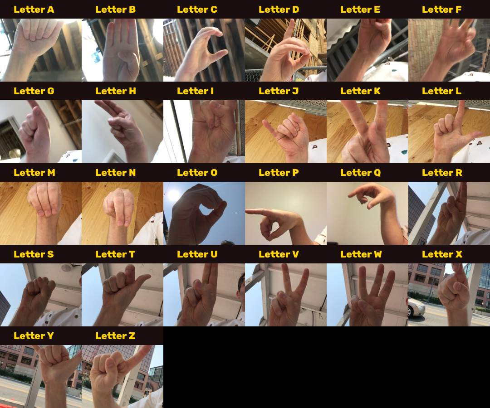
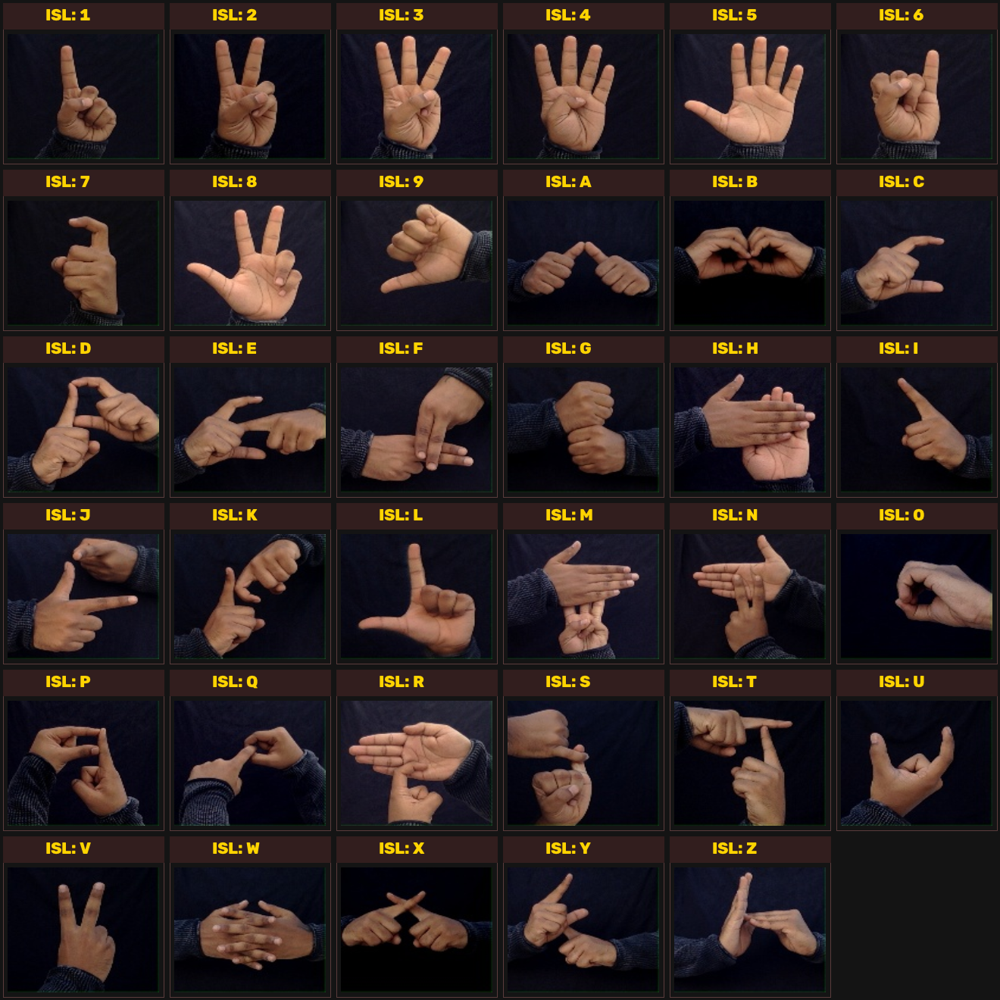

# 🤟 SignLens — Real-Time Sign Language Recognition & Auto-Framing Engine

A production-grade, real-time American Sign Language (ASL) and Indian Sign Language (ISL) translator using **MediaPipe 3D Hand Landmarks**, Neural Network Classifiers, and an **End-to-End Letter-to-Word Auto-Framing & Spellchecking Pipeline**.

---

## 📖 Sign Language Reference Charts

### 🇺🇸 American Sign Language (ASL)


### 🇮🇳 Indian Sign Language (ISL - Dual Hand)


---

## ✨ Features
- **MediaPipe 3D Landmark & Joint Angle Classification**: Invariant to lighting, skin tone, distance, and cluttered backgrounds with rotation alignment and knuckle angle extraction.
- **High Real-World Accuracy**:
  - **ASL Model**: **94.55%** held-out test accuracy across 39 classes.
  - **ISL Model**: **97.90%** held-out test accuracy across 35 classes.
- **Letter-to-Word Auto-Framing**:
  - **Stability Filter**: Eliminates flickering by requiring 8 consecutive stable frames above threshold.
  - **Duplicate Spam Prevention**: Disallows continuous single-gesture spamming.
  - **Word Boundary Detection**: Auto-commits word on `space` gesture or after a 2.0s no-hand timeout.
  - **Spell Correction**: Integrated with `pyspellchecker` to fix minor letter mistakes into valid English vocabulary.
- **Dual Interfaces**:
  1. **Native OpenCV Desktop HUD**: Live multi-hand skeletal rendering, hold gauge, word buffer, top-3 candidates, and sentence tape.
  2. **Browser Web Application**: Zero-dependency client-side neural forward pass + Flask backend.

---

## 📦 Datasets & Downloads

The complete sign language image datasets (ASL and ISL) used for training and testing can be downloaded from Google Drive:

🔗 **[Download Complete Sign Language Datasets (Google Drive)](https://drive.google.com/drive/folders/10_z3LQIsDacNqt62JyHK5FKcp_e27ZIi?usp=sharing)**

---

## 🚀 Quickstart

### 1. Install Dependencies
```bash 
pip install -r requirements.txt
```

### 2. Run Real-Time Desktop App
```bash
python run_native.py
```
**Controls:**
- `1` : Switch to ASL mode
- `2` : Switch to ISL mode
- `b` : Backspace / Delete last letter
- `s` : Space / Commit current word
- `c` : Clear all
- `q` / `ESC` : Quit 

---

### 3. Run Web App
```bash
python app.py
```
Open **`http://localhost:5000`** in your browser.

---

### 4. Train Landmark Models
```bash
python train_landmark_classifier.py
```
Extracts coordinates, caches features, performs a 70/15/15 stratified Train/Val/Test split, evaluates performance, and outputs confusion matrices.
